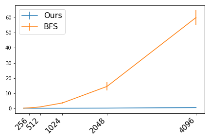

# signed-graph-balance-checker
A fast algorithm to check if a signed graph is balanced.

A signed graph is one whose edges are labeled with a positive or a negative sign.

A signed graph is **balanced** if we can partition its vertices perfectly into two factions; that is, there exists a partition of the vertex set into two subsets such that **no positive edges cross the partition** and there are **no negative edges inside a subset**.

Balance can be checked in polynomial time using spectral methods, or simply by BFS. However, a naive implementation can be slow for large graphs.

Here **we give an algorithm to check balance faster**. The algorithm is essentially BFS. The key idea is to store the necessary information in an appropriate format, so that matrix and vector operations can be used to check balance.

Signed graphs in the wild will often be heavily imbalanced, and a BFS can stop early unless we are very unlucky, so a naive implementation might not be too costly after all. However, if the graph is balanced, this can only be determined once the BFS is complete. This will also be the case if we require a full account of the search results.

## Evaluation

Here are the results of a little experiment to test the efficiency of the algorithm.

For $n \in \\{128, 256, \dots, 4096\\}$ I generated 10 connected (disconnected samples were skipped) Erdős–Rényi $G(n,p)$ graphs with $p=1/10$. I ran my algorithm and a naive (though not too inefficient) implementation of BFS to determine balance. Average running times with st. devs. are shown below.

The log-scale plot on the right suggests that the complexity of both algorithms is bounded by a polynomial of the same degree. However, in practical terms, our proposed algorithm is about 100 times faster.

Linear scale             |  log scale
:-------------------------:|:-------------------------:
  |  